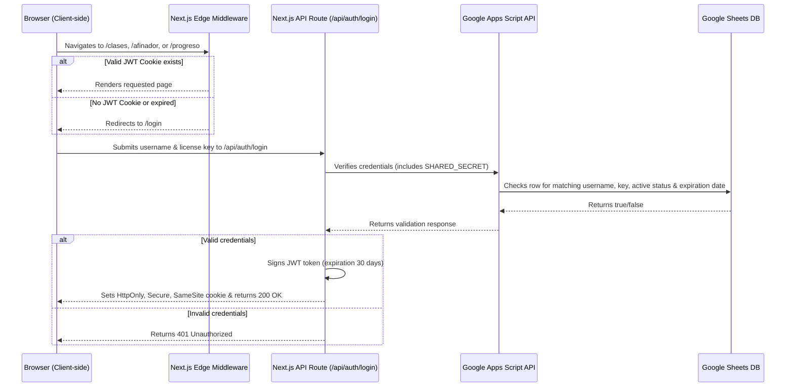

# Design: License Key Access Lock via Google Sheets & JWT

## Goal
Implement a secure, scalable, and 100% free license lock system to monetize the application. Only users with a valid username and active access key registered in a Google Sheet can use the application.

## How Vercel Limits are Affected
- **Bandwidth**: The Next.js application is compiled as a static site with lightweight hydration, which consumes minimal bandwidth (well under Vercel's 100 GB/month limit).
- **Middleware Executions (Hobby Limit: 1M)**: Because Next.js uses client-side routing, page changes (`/clases` -> `/afinador` -> `/progreso`) happen in the browser and do **not** trigger calls to the Vercel middleware server. The middleware is only executed on the initial page load (when the user refreshes or opens the tab) and when calling server APIs. With 6,000 monthly active users, this will consume a very small fraction of the free tier (around 2-5%), keeping your cost at **$0**.

## Architecture & Data Flow


## Google Sheets & Apps Script Setup

### 1. Google Sheets structure
Create a Google Sheet with the following columns in Sheet1:
- `A: Usuario` (e.g., student email)
- `B: Clave` (license key)
- `C: Expiracion` (format `YYYY-MM-DD`)
- `D: Activo` (`TRUE` or `FALSE`)

### 2. Google Apps Script
Deploy the following code as a Web App (Executed as: "Me", Who has access: "Anyone"):

```javascript
const SHARED_SECRET = "YOUR_CONFIGURED_SHARED_SECRET";
const SHEET_ID = "YOUR_GOOGLE_SHEET_ID";

function doPost(e) {
  try {
    const data = JSON.parse(e.postData.contents);
    const authHeader = e.parameter.secret || data.secret;

    if (authHeader !== SHARED_SECRET) {
      return ContentService.createTextOutput(JSON.stringify({ success: false, error: "Unauthorized" }))
        .setMimeType(ContentService.MimeType.JSON);
    }

    const username = (data.username || "").trim().toLowerCase();
    const key = (data.key || "").trim();

    if (!username || !key) {
      return ContentService.createTextOutput(JSON.stringify({ success: false, error: "Missing fields" }))
        .setMimeType(ContentService.MimeType.JSON);
    }

    const sheet = SpreadsheetApp.openById(SHEET_ID).getActiveSheet();
    const rows = sheet.getDataRange().getValues();
    
    // Skip header row
    for (let i = 1; i < rows.length; i++) {
      const dbUser = String(rows[i][0]).trim().toLowerCase();
      const dbKey = String(rows[i][1]).trim();
      const dbExp = rows[i][2]; // Date object
      const dbActive = rows[i][3]; // Boolean

      if (dbUser === username) {
        if (dbKey !== key) {
          return ContentService.createTextOutput(JSON.stringify({ success: false, error: "Invalid key" }))
            .setMimeType(ContentService.MimeType.JSON);
        }
        
        if (dbActive !== true && String(dbActive).toUpperCase() !== "TRUE") {
          return ContentService.createTextOutput(JSON.stringify({ success: false, error: "User is suspended" }))
            .setMimeType(ContentService.MimeType.JSON);
        }

        const expDate = new Date(dbExp);
        const today = new Date();
        today.setHours(0,0,0,0);
        
        if (isNaN(expDate.getTime()) || expDate < today) {
          return ContentService.createTextOutput(JSON.stringify({ success: false, error: "License has expired" }))
            .setMimeType(ContentService.MimeType.JSON);
        }

        return ContentService.createTextOutput(JSON.stringify({ success: true, expiresAt: expDate.toISOString() }))
          .setMimeType(ContentService.MimeType.JSON);
      }
    }

    return ContentService.createTextOutput(JSON.stringify({ success: false, error: "User not found" }))
      .setMimeType(ContentService.MimeType.JSON);

  } catch (err) {
    return ContentService.createTextOutput(JSON.stringify({ success: false, error: err.message }))
      .setMimeType(ContentService.MimeType.JSON);
  }
}
```

## Next.js Environment Variables
Add these to `.env` (not committed) and Vercel configuration dashboard:
- `JWT_SECRET`: A long random string for signing session JWT tokens.
- `LICENSE_APPS_SCRIPT_URL`: The deployed Web App URL from Google Apps Script.
- `LICENSE_SHARED_SECRET`: The same secret configured in the Google Apps Script to authorize server-to-server calls.
